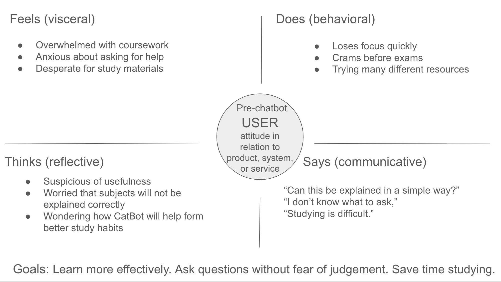
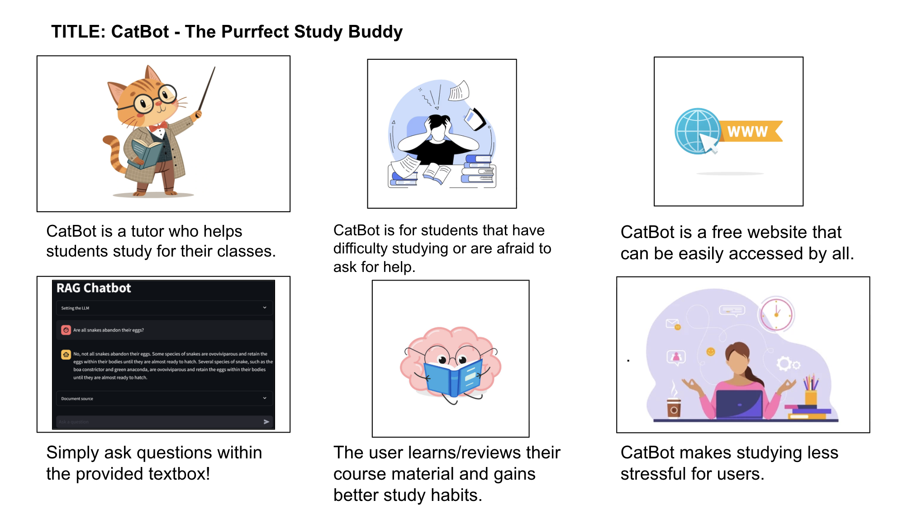
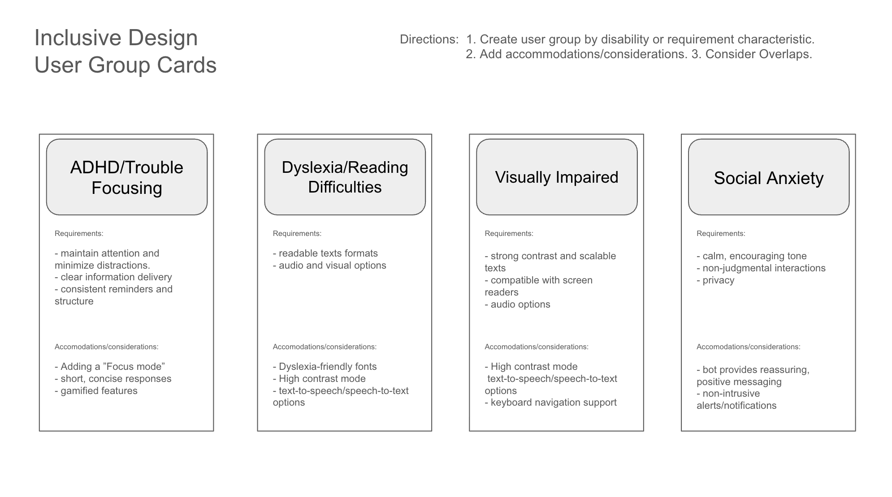

# UX Design Documentation

Visual documentation of CatBot's user experience design process, including empathy mapping, user journey storyboarding, and inclusive design considerations.

---

## Empathy Map

Understanding pre-chatbot user attitudes across four dimensions:

**Key Insights:**
- Students feel anxious and afraid of judgment
- They want simple explanations but don't know where to start
- They avoid asking questions despite needing help
- They express frustration with traditional study methods

**User Goals:**
- Learn more effectively
- Ask questions without fear of judgment
- Save time studying
- Build confidence

---

## UX Storyboard

The user journey from struggling student to confident learner:

**Journey Stages:**
1. **Problem**: Student struggles alone, too embarrassed to ask for help
2. **Discovery**: Hears about free, accessible CatBot
3. **First Interaction**: Gets helpful, engaging response with cat puns
4. **Guided Learning**: Develops understanding through probing questions
5. **Integrity Check**: CatBot refuses to do homework, guides instead
6. **Success**: Better exam performance and study habits
7. **Long-term**: Becomes confident, independent learner

---

## Inclusive Design User Group Cards

Accessibility considerations for diverse student needs:

### Design Accommodations by User Group

**ADHD/Trouble Focusing**
- Clean, minimal interface
- Chunked information
- Consistent formatting

**Visual Impairments**
- Screen reader compatible
- High contrast options
- Keyboard navigation

**Auditory Needs**
- Text-based primary interaction
- Visual feedback for system states

**Motor Skill Variations**
- Large click targets
- Full keyboard support
- No time limits

**Cognitive Processing**
- Plain language
- Step-by-step explanations
- Concrete examples

**Anxiety/Social Challenges**
- Anonymous access
- Non-judgmental responses
- No time pressure

---

## Design Principles

1. **Accessibility First** - Design for diverse abilities
2. **Non-Judgmental Support** - Safe space for all questions
3. **Guided Learning** - Build skills, not just give answers
4. **Clarity and Simplicity** - Clean interface, clear explanations
5. **Privacy** - Anonymous, no account required
6. **Academic Integrity** - Support learning, prevent cheating
7. **Equitable Access** - Free for all students

---

*Designed with empathy, built with accessibility, delivered with cat puns.* 😺
